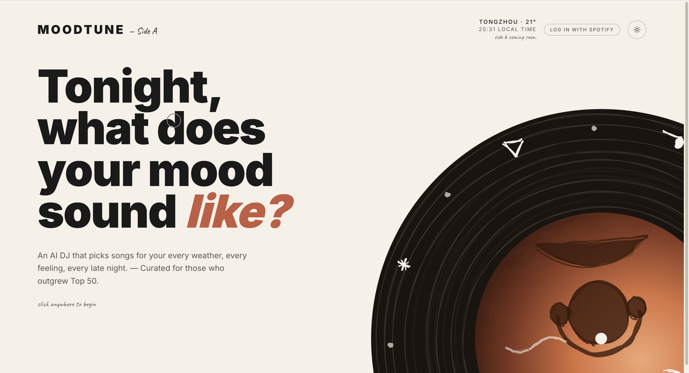

# MoodTune



> Translate tonight's mood into a record — an AI music-discovery layer that sits on top of the catalogs you already use.

## Why MoodTune doesn't play music itself

MoodTune isn't a streaming service. It deliberately doesn't host audio, run a catalog, or sign licensing deals — and that's the point.

Streaming is a solved (and brutally expensive) problem. The part that *isn't* solved is curation that actually reads how you feel right now, rather than scoring engagement against a feature vector. So MoodTune leans on Spotify and YouTube for playback and spends its energy on a single thing: a small AI DJ that listens to your mood, the weather, and what you wrote — and presses three songs into one record for tonight.

A few consequences of that decision:

- **No DRM, no licensing, no catalog plumbing.** Playback is delegated. Discovery stays in our hands.
- **Multi-source by default.** Signed in to Spotify → full-track playback. Otherwise → 30-second previews or a YouTube fallback. The recommendation never depends on what you happen to be subscribed to.
- **The interesting surface is the curation.** Three songs, hand-picked by GLM for this exact moment, framed as a record-sleeve ritual — not a 50-track playlist you'll never finish.

## Features

- **Mood input** — describe the vibe via text, emoji tags, an inner-weather picker, or a photo of right now.
- **AI DJ** — Zhipu GLM (OpenAI-compatible) reads the mood, the local weather, and your listening history, and returns three songs. No padding.
- **Multi-source playback** — Spotify for full tracks when signed in; 30-second previews or YouTube resolution otherwise.
- **Ambient awareness** — the top bar shows live OpenWeatherMap conditions and feeds them into the recommendation.
- **Mood calendar & recap** — every logged night is pressed into a calendar tile; the monthly recap mixes a whole month onto one side.
- **Hand-drawn visuals** — record and waveform animations built with roughjs + Framer Motion, with light/dark theme switching.

## Tech Stack

- **Framework**: Next.js 16 (App Router) + React 19 + TypeScript 5
- **Styling**: Tailwind CSS v4 + Radix UI + shadcn
- **Animation**: Framer Motion, roughjs
- **AI**: Zhipu GLM via the `openai` SDK against the OpenAI-compatible endpoint
- **Data sources**: Spotify Web API, YouTube Data API v3, OpenWeatherMap
- **Hosting**: Vercel

## Local Development

### 1. Requirements

- Node.js ≥ 20
- npm / pnpm / yarn
- A network proxy for external APIs (recommended inside mainland China)

### 2. Install

```bash
npm install
```

### 3. Configure environment variables

```bash
cp .env.example .env.local
```

| Variable | Purpose | Where to get it |
| --- | --- | --- |
| `ZHIPUAI_API_KEY` | Recommendation engine | https://open.bigmodel.cn |
| `OPENWEATHER_API_KEY` | Top-bar weather | https://openweathermap.org/api |
| `SPOTIFY_CLIENT_ID` / `SPOTIFY_CLIENT_SECRET` | Login + full-track playback | https://developer.spotify.com/dashboard |
| `SPOTIFY_REDIRECT_URI` | OAuth callback (must match Dashboard exactly) | Defaults to `http://127.0.0.1:3000/api/auth/spotify/callback` |
| `YOUTUBE_API_KEY` | Resolve "track + artist" into a playable video | https://console.cloud.google.com |

> Spotify no longer accepts `localhost`. Use `127.0.0.1` for local development.

### 4. Run

```bash
npm run dev      # http://127.0.0.1:3000
npm run build
npm run start
npm run lint
```

The `dev` script ships with `HTTP_PROXY` / `HTTPS_PROXY` baked in (`127.0.0.1:7897`); adjust [package.json](package.json) if you don't need them.

## Credits

- Recommendation engine: [Zhipu AI](https://open.bigmodel.cn) (GLM-5.1 for text, GLM-4.5v for images)
- Playback: [Spotify Web API](https://developer.spotify.com) · [YouTube Data API](https://developers.google.com/youtube/v3)
- Weather: [OpenWeatherMap](https://openweathermap.org)
- Hand-drawn rendering: [roughjs](https://roughjs.com)
- Motion: [Framer Motion](https://www.framer.com/motion/)
- UI primitives: [Radix UI](https://www.radix-ui.com) · [shadcn/ui](https://ui.shadcn.com)

## License

MIT © [ArdenGao10](https://github.com/ArdenGao10)

This code is provided for study and reference only. **Commercial use without permission is prohibited.**
